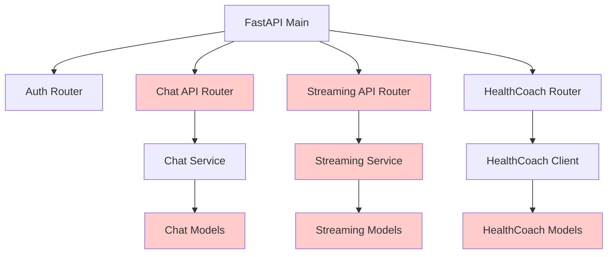
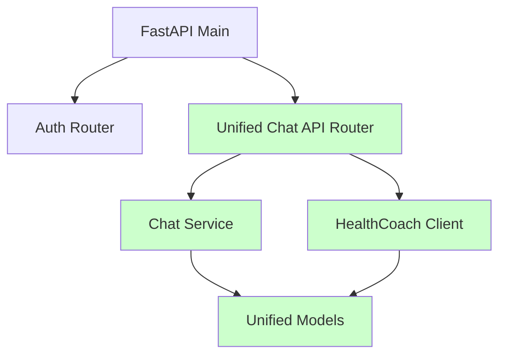

# Design Document

## Overview

HealthmateUI サービスのコードクリーンアップを実施し、重複した機能の統合、未使用コードの削除、設定管理の簡素化を行います。現在の実装には以下の問題があります：

1. **重複したチャット機能**: `/api/chat.py` と `/api/streaming.py` で類似機能が重複
2. **重複したモデル定義**: `models/chat.py` と `healthcoach/models.py` で同じモデルが定義
3. **複雑な設定管理**: `run_dev.py` で過度に複雑な AWS API 呼び出し
4. **未使用のサービス**: `streaming_service.py` が複雑だが実際には使用されていない
5. **散らばったテストファイル**: ルートレベルに多数のテストファイルが配置

## Architecture

### 現在のアーキテクチャの問題点



### 改善後のアーキテクチャ



## Components and Interfaces

### 1. 統合チャット API

**目的**: 重複したチャット機能を単一の API に統合

**現在の問題**:
- `/api/chat.py`: 非ストリーミングチャット機能
- `/api/streaming.py`: ストリーミングチャット機能
- 両者で類似のロジックが重複

**改善案**:
```python
# app/api/chat.py (統合版)
class UnifiedChatRouter:
    @router.post("/send")
    async def send_message(
        request: ChatRequest,
        stream: bool = Query(default=False),
        user_session: UserSession = Depends(require_authentication)
    ):
        """統合されたチャット送信エンドポイント"""
        if stream:
            return await self._handle_streaming_response(request, user_session)
        else:
            return await self._handle_regular_response(request, user_session)
```

### 2. 簡素化された設定管理

**目的**: 複雑な自動設定ロジックを簡素化

**現在の問題**:
- `run_dev.py` で CloudFormation API、AgentCore API を自動呼び出し
- 複雑なフォールバック処理
- エラーハンドリングが過度に詳細

**改善案**:
```python
# app/utils/config.py (簡素化版)
class Config:
    def validate_required_config(self):
        """必須設定のみをチェック"""
        required_vars = [
            "COGNITO_USER_POOL_ID",
            "COGNITO_CLIENT_ID", 
            "HEALTH_COACH_AI_RUNTIME_ID"
        ]
        
        missing = [var for var in required_vars if not getattr(self, var)]
        if missing:
            raise ValueError(f"Missing required environment variables: {missing}")
```

### 3. 統合データモデル

**目的**: 重複したモデル定義を統合

**現在の問題**:
- `models/chat.py` と `healthcoach/models.py` で `ChatMessage` が重複定義
- `MessageRole` 列挙型が複数箇所で定義

**改善案**:
```python
# app/models/__init__.py (統合版)
from .chat import ChatMessage, MessageRole, ChatSession
from .auth import UserSession, UserInfo

__all__ = [
    'ChatMessage', 'MessageRole', 'ChatSession',
    'UserSession', 'UserInfo'
]
```

### 4. 簡素化されたサービス層

**目的**: 過度に複雑なサービス実装を簡素化

**現在の問題**:
- `streaming_service.py` が複雑だが実際には使用されていない
- `chat_service.py` で不要な機能が実装されている

**改善案**:
```python
# app/services/chat.py (簡素化版)
class SimpleChatService:
    def __init__(self):
        # 開発用のシンプルなインメモリストレージ
        self._messages: Dict[str, List[ChatMessage]] = {}
    
    def add_message(self, user_id: str, message: ChatMessage) -> ChatMessage:
        """メッセージを追加（シンプル版）"""
        if user_id not in self._messages:
            self._messages[user_id] = []
        self._messages[user_id].append(message)
        return message
```

## Data Models

### 統合されたモデル構造

```python
# app/models/chat.py (統合版)
class MessageRole(str, Enum):
    USER = "user"
    ASSISTANT = "assistant"

class ChatMessage(BaseModel):
    id: str
    role: MessageRole
    content: str
    timestamp: datetime
    user_id: str
    session_id: Optional[str] = None

class ChatRequest(BaseModel):
    message: str
    timezone: str = "Asia/Tokyo"
    language: str = "ja"
    stream: bool = False

class ChatResponse(BaseModel):
    success: bool
    message: Optional[str] = None
    error: Optional[str] = None
```

## Correctness Properties

*A property is a characteristic or behavior that should hold true across all valid executions of a system-essentially, a formal statement about what the system should do. Properties serve as the bridge between human-readable specifications and machine-verifiable correctness guarantees.*

### Property 1: Unified Chat API Implementation
*For any* chat functionality request, the system should handle both streaming and non-streaming responses through a single API endpoint without code duplication
**Validates: Requirements 1.1, 1.2, 1.3, 1.4**

### Property 2: Simplified Configuration Management
*For any* configuration loading scenario, the system should load settings from environment variables and .env files without making automatic AWS API calls, and fail fast with clear error messages when required configuration is missing
**Validates: Requirements 2.1, 2.2, 2.3, 2.4, 2.5**

### Property 3: Dead Code Elimination
*For any* module, service, or import in the codebase, it should be referenced and used by active code paths, with unused code removed without breaking existing functionality
**Validates: Requirements 3.1, 3.2, 3.3, 3.4**

### Property 4: Service Layer Simplification
*For any* service implementation, it should use simple in-memory storage for development and provide only features that are actively used by the application
**Validates: Requirements 4.1, 4.2, 4.3, 4.4**

### Property 5: Model Definition Consolidation
*For any* data model type, it should be defined in a single location and used consistently across all modules without duplication
**Validates: Requirements 5.1, 5.2, 5.3, 5.4**

### Property 6: Dependency Optimization
*For any* dependency in requirements.txt, it should be imported and used by at least one module, with only essential dependencies maintained for core functionality
**Validates: Requirements 6.1, 6.2, 6.3, 6.4**

### Property 7: Consistent Error Handling
*For any* error condition, the system should provide clear, actionable error messages using consistent formats and appropriate logging without excessive nesting
**Validates: Requirements 7.1, 7.2, 7.3, 7.4**

### Property 8: Test Organization
*For any* test file, it should be located in the tests/ directory, avoid duplication of test functionality, and be organized clearly by feature area
**Validates: Requirements 8.1, 8.2, 8.3, 8.4**

## Error Handling

### 統一されたエラーレスポンス形式

```python
class ErrorResponse(BaseModel):
    success: bool = False
    error_code: str
    error_message: str
    details: Optional[Dict[str, Any]] = None
```

### エラーハンドリング戦略

1. **設定エラー**: 起動時に必須設定をチェックし、不足時は明確なエラーメッセージで終了
2. **API エラー**: 一貫した JSON エラーレスポンスを返却
3. **ログエラー**: 適切なレベルで必要な情報のみをログ出力
4. **例外処理**: ネストした try-catch を避け、シンプルなエラーハンドリング

## Testing Strategy

### 単体テスト戦略

- **テスト配置**: 全てのテストファイルを `tests/` ディレクトリに移動
- **テスト構成**: 機能領域ごとにテストファイルを整理
- **重複排除**: 同じ機能をテストする重複したテストを統合

### プロパティベーステスト戦略

- **テストライブラリ**: pytest + hypothesis を使用
- **テスト実行**: 各プロパティテストは最低100回実行
- **テストタグ**: 各テストに対応する設計プロパティを明記

**テストタグ形式**: `Feature: code-cleanup, Property {number}: {property_text}`

### テスト実装方針

- **単体テスト**: 特定の例、エッジケース、エラー条件をテスト
- **プロパティテスト**: 全入力に対する普遍的なプロパティを検証
- **統合テスト**: コンポーネント間の連携をテスト

### テスト対象

1. **API統合テスト**: 統合されたチャットAPIの動作確認
2. **設定管理テスト**: 設定読み込みとバリデーションの確認
3. **コード品質テスト**: 未使用コードやモデル重複の検出
4. **依存関係テスト**: 不要な依存関係の検出
