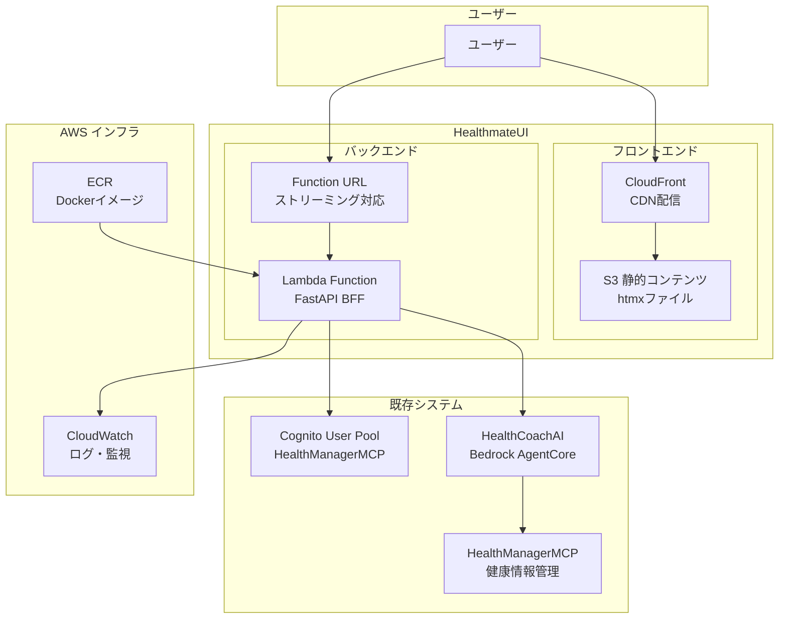
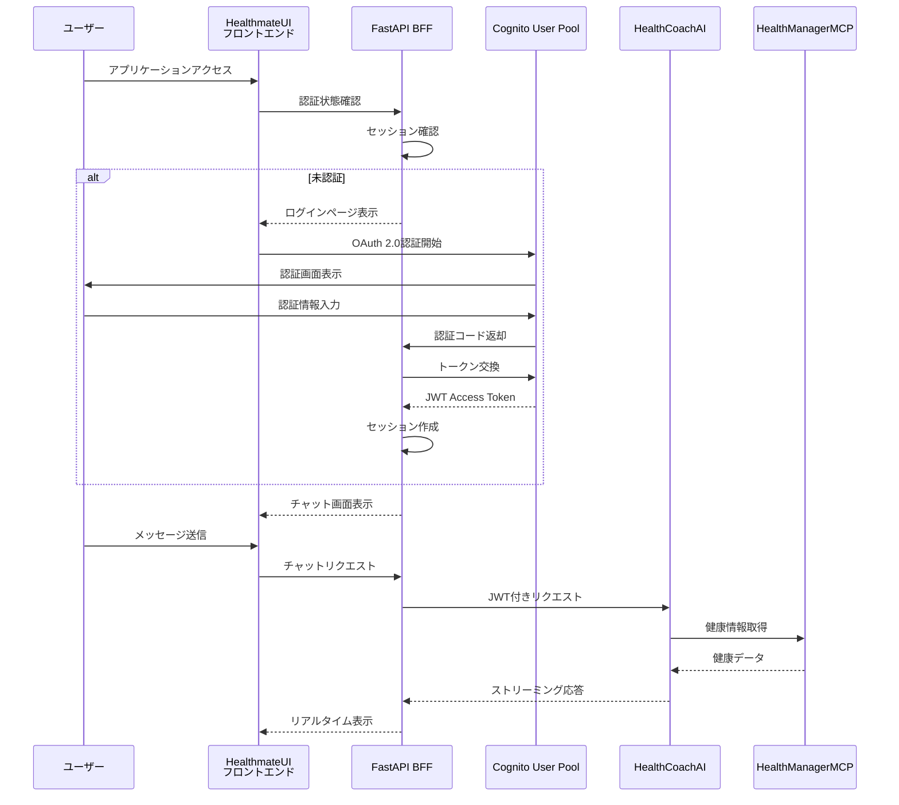

# 設計文書

## 概要

HealthmateUIは、ユーザがHealthCoachAIと対話するためのWebベースのチャットインターフェースです。htmxを使用したレスポンシブなフロントエンドと、Python FastAPIを使用したBFF（Backend for Frontend）で構成されます。既存のHealthManagerMCPのCognito User Poolを利用した認証システムと、Amazon Bedrock AgentCoreランタイムとのリアルタイムストリーミング連携を提供します。AWSリソースはAWS CDKを使用してInfrastructure as Codeで管理されます。

## 技術スタック

### フロントエンド
- **UI Framework**: htmx + HTML/CSS/JavaScript
- **Static Hosting**: Amazon S3 + CloudFront
- **Styling**: CSS3 (レスポンシブデザイン)

### バックエンド
- **Runtime**: AWS Lambda (Python 3.12)
- **Web Framework**: FastAPI
- **Container**: Docker + Amazon ECR
- **Function URL**: AWS Lambda Function URL (ストリーミング対応)

### インフラストラクチャ
- **IaC**: AWS CDK (Python)
- **Authentication**: Amazon Cognito User Pool (既存のHealthManagerMCP)
- **AI Integration**: Amazon Bedrock AgentCore Runtime
- **Monitoring**: Amazon CloudWatch

### テスト
- **Unit Testing**: pytest
- **Property-Based Testing**: Hypothesis
- **E2E Testing**: Playwright
- **Integration Testing**: pytest + moto (AWS mocking)

## アーキテクチャ

### システム全体アーキテクチャ



### 認証フロー



## コンポーネントと インターフェース

### フロントエンド コンポーネント

#### 1. 静的コンテンツ（S3）
- **ファイル構成**:
  - `index.html`: メインページ
  - `login.html`: ログインページ  
  - `chat.html`: チャットインターフェース
  - `styles.css`: スタイルシート
  - `app.js`: htmx設定とカスタムJavaScript

#### 2. htmxインターフェース
- **チャット機能**:
  - `hx-post="/api/chat"`: メッセージ送信
  - `hx-get="/api/history"`: 履歴取得
  - `hx-sse="connect:/api/stream"`: ストリーミング接続
- **認証機能**:
  - `hx-post="/api/auth/login"`: ログイン処理
  - `hx-post="/api/auth/logout"`: ログアウト処理

### バックエンド コンポーネント

#### 1. FastAPI BFF
```python
# メインアプリケーション構造
app/
├── main.py              # FastAPIアプリケーション
├── auth/
│   ├── __init__.py
│   ├── cognito.py       # Cognito認証処理
│   └── middleware.py    # 認証ミドルウェア
├── chat/
│   ├── __init__.py
│   ├── handler.py       # チャット処理
│   └── streaming.py     # ストリーミング処理
├── models/
│   ├── __init__.py
│   ├── auth.py          # 認証関連モデル
│   └── chat.py          # チャット関連モデル
└── utils/
    ├── __init__.py
    ├── config.py        # 設定管理
    └── logger.py        # ログ設定
```

#### 2. APIエンドポイント
- **認証API**:
  - `GET /`: メインページ
  - `GET /login`: ログインページ
  - `POST /api/auth/callback`: OAuth コールバック
  - `POST /api/auth/logout`: ログアウト
  - `GET /api/auth/status`: 認証状態確認

- **チャットAPI**:
  - `GET /chat`: チャットページ
  - `POST /api/chat`: メッセージ送信
  - `GET /api/history`: チャット履歴取得
  - `GET /api/stream`: ストリーミング接続

#### 3. 外部システム連携
- **Cognito連携**:
  - OAuth 2.0認証フロー
  - JWTトークン検証
  - トークンリフレッシュ
- **HealthCoachAI連携**:
  - Bedrock AgentCore Runtime API
  - ストリーミングレスポンス処理
  - JWTトークン転送

## データモデル

### 認証関連モデル

```python
from pydantic import BaseModel
from typing import Optional
from datetime import datetime

class CognitoTokens(BaseModel):
    access_token: str
    refresh_token: str
    id_token: str
    expires_at: datetime

class UserSession(BaseModel):
    user_id: str
    email: str
    tokens: CognitoTokens
    created_at: datetime
    last_accessed: datetime

class AuthStatus(BaseModel):
    is_authenticated: bool
    user_id: Optional[str] = None
    email: Optional[str] = None
```

### チャット関連モデル

```python
class ChatMessage(BaseModel):
    message: str
    timestamp: Optional[datetime] = None

class ChatResponse(BaseModel):
    response: str
    timestamp: datetime
    message_id: str

class ChatHistory(BaseModel):
    messages: List[dict]
    total_count: int
    has_more: bool

class StreamingChunk(BaseModel):
    chunk: str
    is_complete: bool
    message_id: Optional[str] = None
```

## 正確性プロパティ

*プロパティとは、システムのすべての有効な実行において真であるべき特性や動作のことです。これは、人間が読める仕様と機械で検証可能な正確性保証の橋渡しとなる正式な記述です。*

### プロパティ 1: 有効認証情報による認証成功
*すべての*有効なCognito認証情報について、認証処理が成功し、JWTアクセストークンが取得される
**検証対象: 要件 1.2**

### プロパティ 2: 認証成功時のリダイレクト
*すべての*認証成功ケースについて、ユーザはチャットインターフェースにリダイレクトされる
**検証対象: 要件 1.3**

### プロパティ 3: 認証失敗時のエラー処理
*すべての*無効な認証情報について、エラーメッセージが表示され、ログイン状態が維持される
**検証対象: 要件 1.4**

### プロパティ 4: セッション期限切れ時のリダイレクト
*すべての*期限切れセッションについて、ユーザはログインインターフェースにリダイレクトされる
**検証対象: 要件 1.5**

### プロパティ 5: メッセージ送信の完全性
*すべての*有効なメッセージについて、送信時にHealthCoachAIに確実に配信される
**検証対象: 要件 2.1**

### プロパティ 6: ストリーミング応答のリアルタイム表示
*すべての*HealthCoachAI応答について、ストリーミングを使用してリアルタイムで表示される
**検証対象: 要件 2.2**

### プロパティ 7: ストリーミング時の段階的更新
*すべての*ストリーミングデータについて、ページリフレッシュなしで段階的にチャットインターフェースが更新される
**検証対象: 要件 2.3**

### プロパティ 8: メッセージ送信後のUI状態管理
*すべての*メッセージ送信について、入力フィールドがクリアされ、フォーカスが維持される
**検証対象: 要件 2.4**

### プロパティ 9: JWTトークン転送の保証
*すべての*HealthCoachAIリクエストについて、JWTアクセストークンがリクエストヘッダーに含まれる
**検証対象: 要件 3.1**

### プロパティ 10: 無効トークンのエラー処理
*すべての*無効または期限切れJWTトークンについて、認可エラーが適切に処理される
**検証対象: 要件 3.2**

### プロパティ 11: トークンリフレッシュの実行
*すべての*リフレッシュが必要なケースについて、Cognitoを使用してトークンリフレッシュが試行される
**検証対象: 要件 3.3**

### プロパティ 12: リフレッシュ失敗時のエラー返却
*すべての*トークンリフレッシュ失敗について、フロントエンドに認証エラーが返される
**検証対象: 要件 3.4**

### プロパティ 13: チャット履歴の時系列表示
*すべての*チャット履歴について、タイムスタンプ付きで時系列順にメッセージが表示される
**検証対象: 要件 4.2**

### プロパティ 14: 新メッセージの履歴追加
*すべての*新しいメッセージについて、既存の履歴に正しく追加される
**検証対象: 要件 4.4**

### プロパティ 15: 静的コンテンツの配信
*すべての*静的コンテンツリクエストについて、S3からhtmxファイルやフロントエンドアセットが配信される
**検証対象: 要件 5.3**

### プロパティ 16: HTTPリクエストの処理
*すべての*Lambda関数呼び出しについて、Function URL経由でHTTPリクエストが処理される
**検証対象: 要件 5.5**

### プロパティ 17: htmx部分更新の限定性
*すべての*ユーザインタラクションについて、htmxは必要な部分のみを更新し、他の要素を保持する
**検証対象: 要件 6.1**

### プロパティ 18: スクロール位置の維持
*すべての*メッセージ送受信について、適切にスクロール位置が維持される
**検証対象: 要件 6.2**

### プロパティ 19: 視覚的フィードバックの提供
*すべての*インターフェース更新について、ユーザアクションに対する視覚的フィードバックが提供される
**検証対象: 要件 6.3**

### プロパティ 20: エラー時のフロー維持
*すべての*エラー発生について、チャットフローを妨げることなくエラーメッセージが表示される
**検証対象: 要件 6.4**

## エラーハンドリング

### 認証エラー
- **トークン期限切れ**: 自動リフレッシュ試行、失敗時はログイン画面へリダイレクト
- **無効なトークン**: セッションクリア、ログイン画面表示
- **Cognito接続エラー**: エラーメッセージ表示、再試行オプション提供

### チャットエラー
- **HealthCoachAI接続エラー**: 一時的なエラーメッセージ表示、再送信オプション
- **ストリーミング中断**: 接続再試行、部分応答の保持
- **メッセージ送信失敗**: エラー表示、メッセージの再送信可能状態維持

### システムエラー
- **Lambda関数エラー**: CloudWatchログ記録、ユーザーフレンドリーなエラー表示
- **設定エラー**: 起動時チェック、必要な環境変数の検証
- **外部サービスエラー**: 適切なフォールバック処理

## テスト戦略

### 単体テスト
- **認証処理**: Cognitoトークン処理、セッション管理
- **チャット機能**: メッセージ処理、履歴取得
- **ストリーミング**: チャンク処理、接続管理
- **エラーハンドリング**: 各種エラーケースの処理

### プロパティベーステスト
- **テストライブラリ**: Hypothesis（Python）を使用
- **実行回数**: 各プロパティテストは最低100回実行
- **テスト対象**: 上記で定義した6つの正確性プロパティ
- **テストタグ**: 各プロパティベーステストに以下の形式でコメント付与
  - `**Feature: healthmate-ui, Property {number}: {property_text}**`

### 統合テスト
- **認証フロー**: Cognito OAuth 2.0フロー全体
- **チャット機能**: HealthCoachAIとの連携
- **ストリーミング**: リアルタイム通信
- **エラー処理**: 外部サービス障害時の動作

### E2Eテスト
- **Playwright**: ブラウザ自動化テスト
- **ユーザーシナリオ**: ログインからチャットまでの完全フロー
- **レスポンシブテスト**: 異なる画面サイズでの動作確認